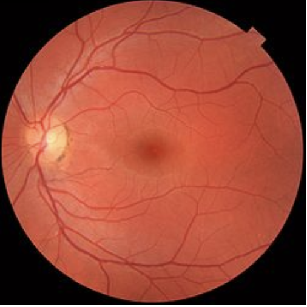
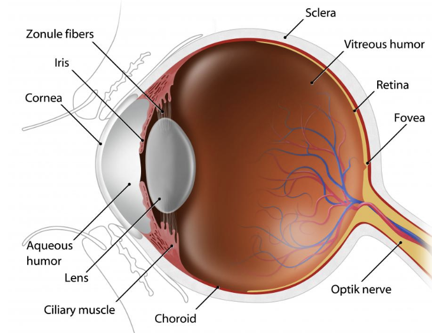

# CS551 Project


Creating a new dataset requires the presence of a large amount of skilled manpower, time and money. Generative Adversarial Network (GAN) can help mitigate this problem as it can be used to generate new data from Random noise and given small dataset. In this project, we shall use GAN to generate a dataset of images of fundus manifesting diabetic retinopathy. [Diabetic retinopathy](https://en.wikipedia.org/wiki/Diabetic_retinopathy) is a diabetic eye disease, which is a leading cause of blindness all over the world. The dataset thus generated form our modle will be immensely useful to classify the diseases present in fundus at a later stage.

## Fundus
Fundus images are the images of the interior surface of the eye opposite the lens and includes retina, optic disc etc. Diabetic retinopathy is a diabetes complication that affects eyes and caused by damage to the blood vessels of the light-sensitive tissue at the back of the eye (retina). It can be detected with the help of fundus images.





## Method

We
## Dataset 

Any GAN requires small real world data to train the discriminator. For our project, this dataset was taken from [kaggle](https://www.kaggle.com/c/diabetic-retinopathy-detection/data). We made use of about 709 images level 4 diabetic retinopathy images from this dataset. 


## Dependencies
```
pytorch-gpu
matplotlib
sklearn
numpy

```

## Code Description
The code contains 4 main files
```
generate.py
utils.py
dcgan.py
train.py
```

## Descriptions of files
1. `dcgan.py` : This contains the code for implementing the model of Deep Convolutional GANs. Paper: [Unsupervised Representation Learning with Deep Convolutional Generative Adversarial Networks](https://arxiv.org/abs/1511.06434) 
2. `generate.py`: Contains the code to generate images from the trained model
3. `utils.py`: Utility file to give dataset location, dataloader etc.
4. `train.py` : Contains the code to train the GAN model, this contains the provision to generate and print the tranining progression over the period of time.

## Training Progress

